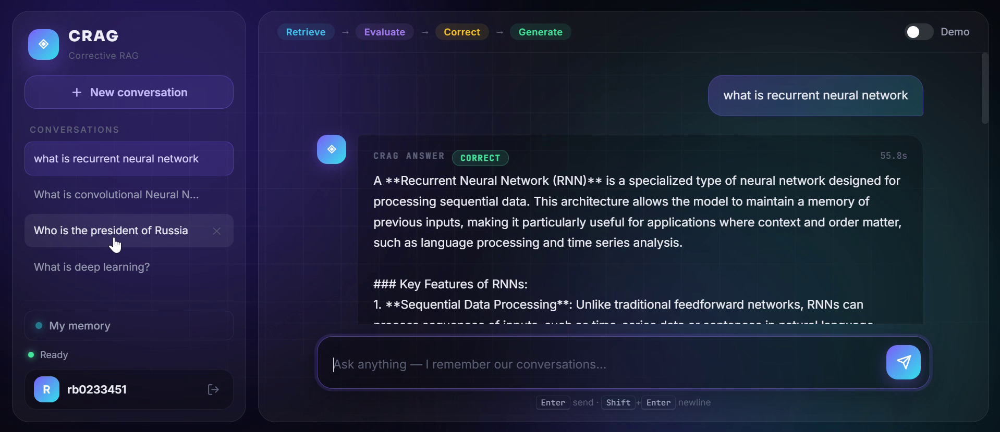
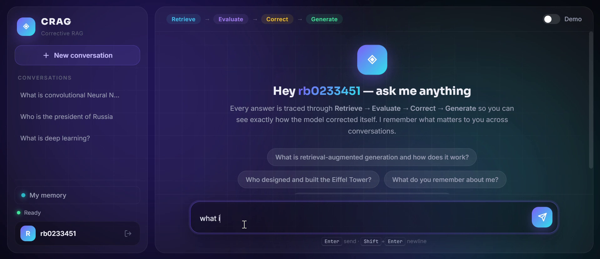
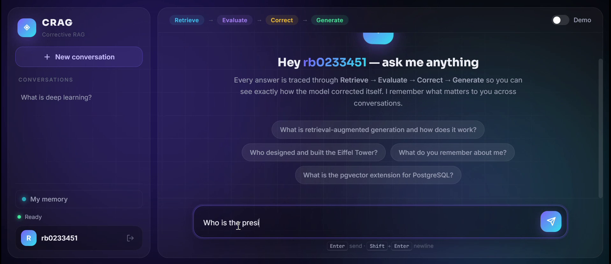

# CRAG-MASTRA — A RAG Chatbot That Knows When It's Wrong

A self-correcting **Corrective Retrieval-Augmented Generation (CRAG)** chatbot with persistent, per-user memory. Instead of answering confidently from bad retrievals, the agent **grades its own retrieval quality** and dynamically decides whether to trust the documents, fall back to live web search, or blend both.

Built with **Mastra** (agents, tools, 4-layer memory), **GPT-4o-mini** via Vercel AI Gateway, **Upstash Vector**, **Tavily**, and **libSQL**.



## How it works

Every question runs through a 4-stage agentic pipeline:

```
RETRIEVE  →  EVALUATE  →  CORRECT  →  GENERATE
```

1. **Retrieve** — 5-stage retrieval: HyDE hypothetical-answer embeddings, multi-query expansion, hybrid semantic + keyword scoring, source-diverse selection, and LLM cross-encoder re-ranking.
2. **Evaluate** — an LLM judge scores every document's relevance and emits a confidence verdict:
   - `CORRECT` → refine internal documents and answer
   - `INCORRECT` → rewrite the query and search the web (Tavily)
   - `AMBIGUOUS` → do both and present sources for each claim
3. **Correct** — decompose-then-recompose refinement: documents are split into strips, each strip is scored for usefulness, noise is discarded.
4. **Generate** — a grounded answer with source citations, checked for faithfulness against the refined knowledge.

The live pipeline trace is streamed to the UI over SSE — you can watch the agent retrieve, self-evaluate, and correct in real time:



## Under the hood — a real query trace

Every stage logs its decisions. Here is an actual trace for *"What is a recurrent neural network?"* against an ingested deep-learning textbook:

```text
[CRAG] 1. RETRIEVE — "What is a recurrent neural network?"

[RETRIEVER] Stage 1 - HyDE embedding...
[HyDE] Hypothetical: "A recurrent neural network (RNN) is a class of artificial
       neural networks designed for processing sequences of data by u..."

[RETRIEVER] Stage 2 - Multi-query expansion...
[MULTIQUERY] 3 variations generated:
  1. "Can you explain what a recurrent neural network is?"
  2. "What does the term recurrent neural network refer to?"
  3. "Could you provide a definition of a recurrent neural network?"

[RETRIEVER] Stage 3 - Fetching (5 queries x 25)...
[RETRIEVER] Raw pool: 38 unique chunks

[RETRIEVER] Stage 4b - Source-diverse selection...
[RETRIEVER] Diversity: +2 chunk(s) guaranteed from "Deep+Learning+Ian+Goodfellow"
[RETRIEVER] Pool = 5 global-top + 2 diversity = 7 total

[CRAG] 2. EVALUATE — scoring 7 documents...
[CRAG] 2. EVALUATE done — confidence: CORRECT (max score: 1.00)
         +0.80  [Deep+Learning+Ian+Goodfellow] ✓ relevant
         -0.80  [Deep+Learning+Ian+Goodfellow] ✗ irrelevant
         +1.00  [Deep+Learning+Ian+Goodfellow] ✓ relevant
         +0.40  [Deep+Learning+Ian+Goodfellow] ✓ relevant
         -0.20  [Deep+Learning+Ian+Goodfellow] ✗ irrelevant
         -1.00  [Deep+Learning+Ian+Goodfellow] ✗ irrelevant
         +0.60  [Deep+Learning+Ian+Goodfellow] ✓ relevant

[CRAG] 3. CORRECT (refine) — 7 scored documents...
[REFINER] Decomposed 7 docs into 15 strips
[REFINER] Strip  1 KEEP (0.90)  "...convolutional networks perf..."
[REFINER] Strip 10 DROP (-0.90) "An input feature is computed with a regu..."
[REFINER] Kept 9/15 strips
[CRAG] 3. CORRECT (refine) done — kept 9/15 strips

[CRAG] 4. GENERATE — streaming answer...
[CRAG] 4. GENERATE done — 55.8s total
```

The verdict (`CORRECT` here) is a control signal, not just a metric — it decides whether the agent answers from documents, falls back to web search, or blends both.

## Memory — the agent remembers you

Four layers via Mastra, isolated per user account:

| Layer | What it does |
|---|---|
| Message history | Recent conversation injected every turn |
| Working memory | Persistent user profile (name, preferences, goals) the agent maintains itself, shared across all conversations |
| Semantic recall | Vector search over all past messages — relevant history resurfaces per-query |
| Observational memory | Background summarization of long conversations (5–40x compression) |

Users sign up / sign in (scrypt hashing, httpOnly sessions); conversations, embeddings, and memory are scoped to the account.



## Engineering highlights

- **Server-side run cache** — tool outputs flow between pipeline stages at full fidelity server-side instead of being relayed (and truncated) through the LLM's tool-call arguments. Fixed systematic evaluation corruption and cut latency ~50%.
- **Table-aware PDF ingestion** — extractors fuse table rows into strings like `Blinkit₹1,156-12%46%` that naive chunkers silently drop. A linearization pass reconstructs rows against their headers into atomic, searchable `TABLE:` chunks.
- **Memory re-verification** — remembered answers are re-checked against fresh retrieval before reuse, and document/web conflicts are presented explicitly with both sources.

## Quickstart

```bash
npm install
cp .env.example .env   # add your keys
npm run ingest -- ./your-document.pdf
npm run serve          # → http://localhost:3000
```

Requires: `AI_GATEWAY_API_KEY` (Vercel AI Gateway), `UPSTASH_VECTOR_REST_URL` + `UPSTASH_VECTOR_REST_TOKEN`, `TAVILY_API_KEY`.

## Project structure

```
src/
├── mastra/
│   ├── agents/crag-agent.js    # the CRAG agent (pipeline rules, memory policy)
│   ├── tools/index.js          # 5 tools: retrieve, evaluate, refine, rewrite, web-search
│   ├── memory.js               # 4-layer Mastra memory configuration
│   └── workflows/              # deterministic workflow variant
├── lib/
│   ├── retriever.js            # 5-stage retrieval engine
│   ├── evaluator.js            # relevance scoring → confidence verdict
│   ├── refiner.js              # strip-level knowledge refinement
│   ├── ingest.js               # PDF ingestion + table linearization
│   ├── auth.js                 # accounts, sessions, per-user scoping
│   └── run-context.js          # server-side run cache between tools
└── server.js                   # Express + SSE streaming + auth API
public/                         # zero-dependency frontend (auth, chat, pipeline trace)
```
